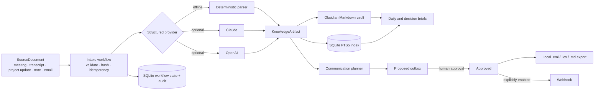

# Workflow AI

Workflow AI is a local-first executive knowledge and coordination system built around an Obsidian-compatible Markdown vault. It converts meetings, transcripts, project updates, email-like notes, and ad hoc documents into structured knowledge; makes that knowledge searchable; produces daily and decision briefs; and turns explicit commitments into approval-gated communication drafts.

The repository is designed as a portfolio-grade response to an AI Workflow Engineer / executive systems role. It demonstrates information architecture, structured AI extraction, workflow state, auditability, human review, API and CLI surfaces, deployment scaffolding, and an explicit roadmap for safer real-world integrations.

## The system in one picture



The model interprets bounded input into a strict schema. Deterministic application code owns placement, idempotency, state transitions, approval policy, persistence, and side effects.

## What is implemented

| Capability | Implementation |
|---|---|
| Obsidian vault ownership | Non-destructive taxonomy initialization, YAML frontmatter, wiki links, stable paths, project maps of content, and rebuildable indexing |
| Information consolidation | One `SourceDocument` input contract and one `KnowledgeArtifact` output contract across meetings, transcripts, project updates, notes, and email-like text |
| AI and JSON-schema fluency | Provider-neutral Pydantic models with optional Anthropic and OpenAI structured-output adapters |
| Offline operation | A deterministic line-oriented provider for demos, tests, and zero-key operation |
| Retrieval | SQLite FTS5 over Markdown title, body, tags, and projects; precise `AND` retrieval with a bounded `OR` fallback |
| Executive decision support | Daily briefs and evidence-bounded decision briefs |
| Coordination automation | Proposed stakeholder updates, email follow-ups, and calendar review blocks derived from explicit decisions/actions/risks |
| Human control | `proposed → approved → dispatched`; edits revoke approval; dispatch from any other state is rejected |
| Safe demonstration | Default dispatch writes reviewable files locally rather than contacting email or calendar providers |
| Operational evidence | Workflow runs, metadata-only audit events, deterministic evaluation cases, tests, Docker, and GitHub Actions |
| Continuous improvement | A staged information-flow and integration roadmap in `docs/automation-roadmap.md` |

## Quick start

Requirements: Python 3.12 or 3.13 and [`uv`](https://docs.astral.sh/uv/).

```zsh
cp .env.example .env
uv sync --group dev
uv run workflow-ai init
bash scripts/demo.sh
```

The default provider is deterministic and does not require an API key. Runtime state is written to `.workflow-ai/`; the Obsidian-compatible vault is `vault/`.

Start the API:

```zsh
uv run workflow-ai serve --host 127.0.0.1 --port 8080
```

Open `http://127.0.0.1:8080/docs` for the generated OpenAPI interface.

## Deterministic source format

The offline provider recognizes explicit line-oriented directives. Ordinary narrative is retained for the summary and provenance section.

```text
TITLE: Product Launch Leadership Sync
DATE: 2026-07-30T15:00:00+00:00
PARTICIPANTS: Maya Chen, Omar Rahman
PROJECT: Atlas Launch
TOPICS: launch readiness, legal review

The launch remains on track for August 18.
DECISION: Keep the August 18 launch date | Readiness checks passed | Maya Chen
ACTION: omar@example.com | 2026-08-04 | high | Obtain final legal approval
RISK: high | Legal review may delay onboarding | Escalate unresolved clauses
QUESTION: Are support staffing levels sufficient?
```

This format is intentionally explicit: a sentence that merely contains the word `ACTION:` inside prose is not promoted into an action item.

## CLI

```text
workflow-ai init
workflow-ai ingest PATH [--kind meeting] [--project NAME] [--participant NAME]
workflow-ai search QUERY [--limit 10]
workflow-ai reindex
workflow-ai brief daily [--date YYYY-MM-DD]
workflow-ai brief decision "QUESTION" [--evidence-limit 8]
workflow-ai outbox list [--status proposed]
workflow-ai outbox edit OUTBOX_ID DRAFT.json [--actor NAME]
workflow-ai outbox approve OUTBOX_ID [--actor NAME]
workflow-ai outbox dispatch OUTBOX_ID [--actor NAME] [--mode filesystem|webhook]
workflow-ai audit [--run-id UUID]
workflow-ai eval run [--dataset evals/golden.jsonl] [--minimum-score 0.95]
workflow-ai serve [--host 127.0.0.1] [--port 8080]
```

### Ingest and retrieve

```zsh
uv run workflow-ai ingest examples/inputs/leadership-sync.txt \
  --kind meeting \
  --project "Atlas Launch" \
  --stakeholder chief-of-staff@example.com

uv run workflow-ai search "legal approval onboarding"
uv run workflow-ai brief daily --date 2026-07-31
uv run workflow-ai brief decision "Should Atlas keep the August 18 launch date?"
```

### Review and export a proposed communication

```zsh
uv run workflow-ai outbox list --status proposed
uv run workflow-ai outbox approve <OUTBOX_ID> --actor "ehza"
uv run workflow-ai outbox dispatch <OUTBOX_ID> --actor "ehza" --mode filesystem
```

The resulting `.eml`, `.ics`, or `.md` file appears below `.workflow-ai/dispatch/`. This is an export artifact, not proof that a message or event was delivered.

## Provider configuration

### Anthropic

```zsh
uv sync --extra anthropic --group dev
export WORKFLOW_AI_LLM_PROVIDER=anthropic
export ANTHROPIC_API_KEY='...'
export WORKFLOW_AI_ANTHROPIC_MODEL='claude-sonnet-5'
```

### OpenAI

```zsh
uv sync --extra openai --group dev
export WORKFLOW_AI_LLM_PROVIDER=openai
export OPENAI_API_KEY='...'
export WORKFLOW_AI_OPENAI_MODEL='gpt-5.5'
```

Provider model IDs are configuration. Use a model available to the account and validate any model change with the golden evaluation set before rollout.

## API

All protected endpoints use `X-API-Key` only when `WORKFLOW_AI_API_KEY` is configured. `/healthz` remains unprotected for container health checks.

| Method | Route | Purpose |
|---|---|---|
| `GET` | `/healthz` | Runtime health and provider identity |
| `POST` | `/v1/intake` | Ingest a JSON `SourceDocument` envelope |
| `GET` | `/v1/search?q=...` | Search the Markdown index |
| `POST` | `/v1/index/rebuild` | Rebuild FTS5 from the vault |
| `POST` | `/v1/briefs/daily` | Generate a daily brief |
| `POST` | `/v1/briefs/decision` | Generate an evidence-bounded decision brief |
| `GET` | `/v1/outbox` | List proposed/approved/dispatched items |
| `PUT` | `/v1/outbox/{id}` | Replace a draft and revoke prior approval |
| `POST` | `/v1/outbox/{id}/approve` | Record named human approval |
| `POST` | `/v1/outbox/{id}/dispatch` | Export or dispatch an approved item |
| `GET` | `/v1/audit` | Read metadata-only audit events |

Example:

```zsh
curl -sS http://127.0.0.1:8080/v1/intake \
  -H 'Content-Type: application/json' \
  -H "X-API-Key: $WORKFLOW_AI_API_KEY" \
  -d '{
    "source": {
      "source_name": "briefing-note.txt",
      "kind": "note",
      "content": "TITLE: Briefing note\nACTION: alex@example.com | 2026-08-03 | high | Confirm vendor terms",
      "participants": [],
      "projects": ["Vendor Review"],
      "sensitivity": "internal",
      "metadata": {}
    },
    "propose_communications": true
  }' | jq
```

## Vault structure

```text
vault/
├── Home.md
├── 00_Inbox/
├── 10_People/
├── 20_Meetings/
├── 30_Projects/
├── 40_Decisions/
├── 50_Areas/
├── 60_Briefs/
├── 70_Resources/
├── 90_Archive/
└── Templates/
```

Generated notes contain a nested `workflow_ai.artifact` object in YAML frontmatter plus a human-readable body. Original source text is embedded in a collapsed provenance section. Project notes are routed to a project directory; meetings and briefs are grouped by year; unclassified material remains in the inbox.

## Persistence model

Workflow AI deliberately separates three kinds of state:

1. **Markdown vault:** durable, human-readable organizational memory.
2. **FTS5 database:** a derived search index that can be rebuilt from Markdown.
3. **Workflow SQLite database:** idempotency, run state, outbox state, and metadata-only audit events.

That split keeps workflow transitions transactional without making a proprietary database the only way to read the knowledge base.

## Safety invariants

- Imported source content is treated as untrusted data in provider prompts.
- Provider output is validated against strict Pydantic schemas with unknown fields rejected.
- A communication cannot be dispatched before explicit approval.
- Editing an approved or failed draft returns it to `proposed` and clears approval.
- The default dispatcher performs no network request.
- Webhook dispatch requires both an explicit mode and `WORKFLOW_AI_LIVE_DISPATCH_ENABLED=true`.
- Vault and runtime paths must remain beneath `WORKFLOW_AI_WORKSPACE_ROOT`.
- Audit payloads store hashes, counts, IDs, and event metadata—not full source bodies.
- Imported source text is **not** passed through a DLP or secret-redaction engine. Do not ingest credentials; see `SECURITY.md`.

## Development and verification

```zsh
uv sync --all-extras --group dev
uv run ruff check .
uv run ruff format --check .
uv run mypy src
uv run pytest --cov=workflow_ai --cov-report=term-missing
uv run workflow-ai eval run --dataset evals/golden.jsonl --minimum-score 0.95
```

Or run:

```zsh
make check
```

### Docker

```zsh
cp .env.example .env
docker compose up --build
```

The container exposes port `8080`, mounts `./vault` at `/app/vault`, and stores workflow databases and exported drafts in the `workflow-runtime` volume.

## Design documents

- [`docs/job-description-mapping.md`](docs/job-description-mapping.md) — responsibility-by-responsibility mapping to code and verification.
- [`docs/architecture.md`](docs/architecture.md) — boundaries, sequence, state ownership, and extension points.
- [`docs/taxonomy.md`](docs/taxonomy.md) — vault information architecture and maintenance rhythm.
- [`docs/evaluation.md`](docs/evaluation.md) — extraction and workflow evaluation strategy.
- [`docs/threat-model.md`](docs/threat-model.md) — trust boundaries, controls, and residual risk.
- [`docs/runbook.md`](docs/runbook.md) — operation, backup, restore, and incidents.
- [`docs/automation-roadmap.md`](docs/automation-roadmap.md) — staged information-flow improvement plan.

## Intentional limits

This release does not connect directly to Gmail, Google Calendar, Outlook, Slack, Teams, or an executive’s contact directory. It models the connector boundary and creates local review artifacts; production adapters require organization-specific OAuth scopes, recipient policy, retention rules, delivery idempotency, and incident procedures.

It also does not use embeddings by default. FTS5 is the inspectable lexical baseline. Hybrid retrieval should be added only after a labeled query set demonstrates where lexical recall is insufficient.

## License

MIT
