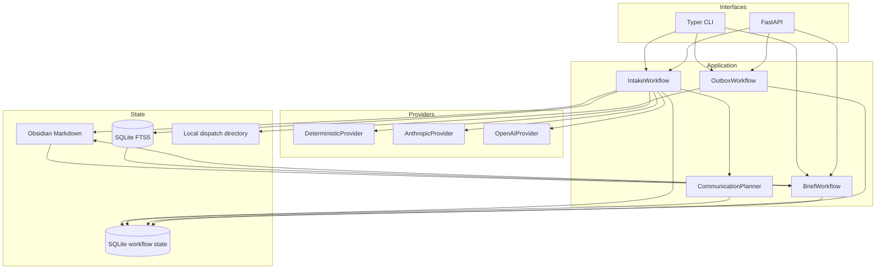
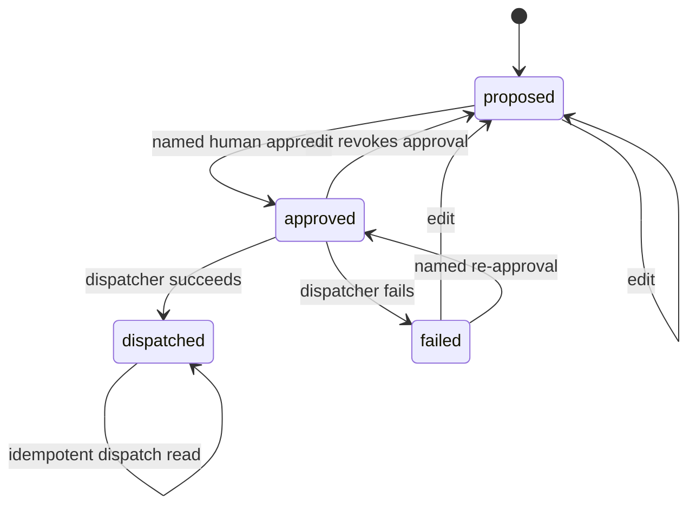

# Architecture

## Architectural thesis

Workflow AI is a knowledge-operations system with probabilistic extraction inside it—not an unconstrained agent with filesystem and messaging access. The architecture separates source evidence, model interpretation, deterministic policy, human authorization, workflow state, and external effects.

## Components



`Services.build()` is the composition root. It creates the configured provider, SQLite adapters, vault writer, FTS index, and workflows for both the CLI and API.

## State ownership

### Markdown vault

The vault is the operator-facing knowledge representation. Generated notes use ordinary Markdown, YAML frontmatter, and Obsidian wiki links. Each generated artifact includes:

- source name and source hash;
- workflow run ID;
- occurrence and ingestion timestamps;
- projects, participants, topics, sensitivity, and status;
- the serialized `KnowledgeArtifact`;
- a human-readable body;
- the original source text in a collapsed provenance section.

`workflow-ai init` only creates missing scaffolding; it does not rewrite existing notes.

### FTS5 index

`.workflow-ai/vault-index.sqlite` is derived state. It indexes Markdown title, body, tags, and projects. `workflow-ai reindex` deletes and rebuilds the index from the vault. Search first requires all terms; when that returns no rows, it retries with a bounded any-term query to improve recall for natural-language decision questions.

### Workflow store

`.workflow-ai/workflow.sqlite` owns transactional application state:

- idempotent workflow runs;
- completion/failure metadata;
- communication drafts and approval status;
- dispatch receipts;
- metadata-only audit events.

The store does not duplicate full source content.

### Dispatch directory

`.workflow-ai/dispatch/` receives local `.eml`, `.ics`, or `.md` export artifacts. The filesystem dispatcher does not contact a third party. The optional webhook dispatcher is a real network side effect and is disabled unless explicitly configured.

## Ingestion sequence

```mermaid
sequenceDiagram
  participant Caller
  participant Intake as IntakeWorkflow
  participant Store as WorkflowStore
  participant Provider as LLMProvider
  participant Writer as VaultWriter
  participant Index as VaultIndex
  participant Planner as CommunicationPlanner

  Caller->>Intake: SourceDocument + options
  Intake->>Intake: validate size; canonicalize; hash
  Intake->>Store: begin_run(idempotency key, input hash)
  alt completed duplicate
    Store-->>Intake: persisted output
    Intake-->>Caller: reused IngestResult
  else new or resumable run
    Intake->>Store: intake.started audit event
    Intake->>Provider: normalize(source)
    Provider-->>Intake: KnowledgeArtifact
    Intake->>Intake: merge operator-supplied context
    Intake->>Writer: atomic Markdown write
    Intake->>Index: upsert(note)
    opt propose communications
      Intake->>Planner: propose(artifact, source)
      Planner-->>Intake: CommunicationDraft[]
      Intake->>Store: create proposed outbox rows
    end
    Intake->>Store: complete run + audit event
    Intake-->>Caller: IngestResult
  end
```

## Communication state machine



The workflow checks state before constructing a dispatcher. On a dispatch exception, it records failure metadata and an audit event, then re-raises the error.

## Provider contract

All providers implement:

```python
async def normalize(source: SourceDocument) -> KnowledgeArtifact: ...

async def decision_brief(
    *, question: str, evidence: list[SearchHit]
) -> DecisionBriefDraft: ...
```

The deterministic provider is line-oriented and offline. Anthropic and OpenAI use their SDKs' structured parsing helpers with Pydantic output models. Optional SDK imports are lazy so the base installation remains usable without either provider.

## Decision support

A daily brief reads generated artifacts, filters out completed actions, ranks priorities and risks, and writes a derived note linked to its sources.

A decision brief searches the local index, passes only the bounded hit packet to the configured provider, and writes the provider's typed options, recommendation, evidence, uncertainties, and next steps. It is decision support, not automatic decision authority.

## Reliability properties

- Atomic Markdown replacement prevents partial files.
- SQLite transactions guard state transitions.
- Caller-supplied or content-derived idempotency keys prevent duplicate workflow execution.
- Reusing one key for a different input fails with a conflict.
- Completed workflow output is persisted and returned on retry.
- Paths are resolved beneath a configured workspace root.
- Provider and dispatch dependencies are behind interfaces.

## Extension points

### Native email/calendar integrations

Implement `Dispatcher`, preserve the approval gate, use provider-side idempotency keys, record external request IDs, and add least-privilege OAuth. Prefer draft creation over immediate send for early deployments.

### Additional source adapters

Parse an external format into `SourceDocument` outside the core workflow. Avoid adding provider-specific objects to the domain model.

### Hybrid retrieval

Keep FTS5 as a lexical baseline. Add embeddings/reranking only with a labeled retrieval suite and source-path provenance in every result.

### Multi-user deployment

A production multi-user version would replace local SQLite state with a transactional shared store, introduce authentication/authorization and tenant boundaries, encrypt persisted data, run background workers, and define retention and recovery objectives.
